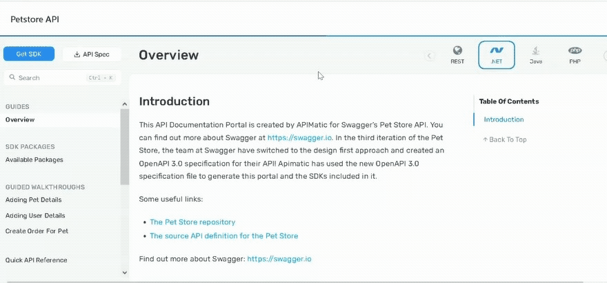

SDK Source code can be downloaded from this portal in 6 Programming languages by switching to the desired language via the languages dropdown and clicking on the download SDK button.

In addition, the following SDKs can also be downloaded from Package repositories:

* [C# SDK](https://www.nuget.org/packages/sdksio.SwaggerPetstore3SDK/1.0.0)
* [PHP SDK](https://packagist.org/packages/sdksio/swagger-petstore-3-sdk#1.0.0)
* [Python SDK](https://pypi.org/project/sdksio-swagger-petstore-3-sdk/1.0.0/)
* [Ruby SDK](https://rubygems.org/gems/sdksio-swagger-petstore-3-sdk/versions/1.0.0)
* [TS SDK](https://www.npmjs.com/package/sdksio-swagger-petstore-3-sdk/v/1.0.0)